  <h1>
    
    Olá, eu sou Erick Dias!
  </h1>
  <h3>Full Stack Developer | React • Next.js • Node.js • Java • TypeScript</h3>

---

### 🛠 Linguagens e Ferramentas

  <table>
    <tr>
      <td align="center"><b>Front-End</b> 
        
      </td>
      <td align="center"><b>Mobile</b> 
         
        React Native
      </td>
    </tr>
    <tr>
      <td align="center"><b>Back-End & Banco de Dados</b> 
        
      </td>
      <td align="center"><b>Ferramentas</b> 
         
        Scrum / Kanban
      </td>
    </tr>
  </table>

   
  <b>Outros conhecimentos:</b> Integração de APIs REST &nbsp;•&nbsp; Responsividade &nbsp;•&nbsp; UI/UX &nbsp;•&nbsp; Consumo de APIs &nbsp;•&nbsp; Deploy de aplicações

---

### 📊 GitHub Stats

  

  

---

### 🐍 Contribuições

<picture>
  <source media="(prefers-color-scheme: dark)" srcset="https://raw.githubusercontent.com/erick-dias/erick-dias/output/github-contribution-grid-snake-dark.svg">
  <source media="(prefers-color-scheme: light)" srcset="https://raw.githubusercontent.com/erick-dias/erick-dias/output/github-contribution-grid-snake.svg">
  
</picture>

### 👾 Pac-Man

<picture>
  <source media="(prefers-color-scheme: dark)" srcset="https://raw.githubusercontent.com/erick-dias/erick-dias/output/pacman-contribution-graph.svg">
  <source media="(prefers-color-scheme: light)" srcset="https://raw.githubusercontent.com/erick-dias/erick-dias/output/pacman-contribution-graph.svg">
  
</picture>
